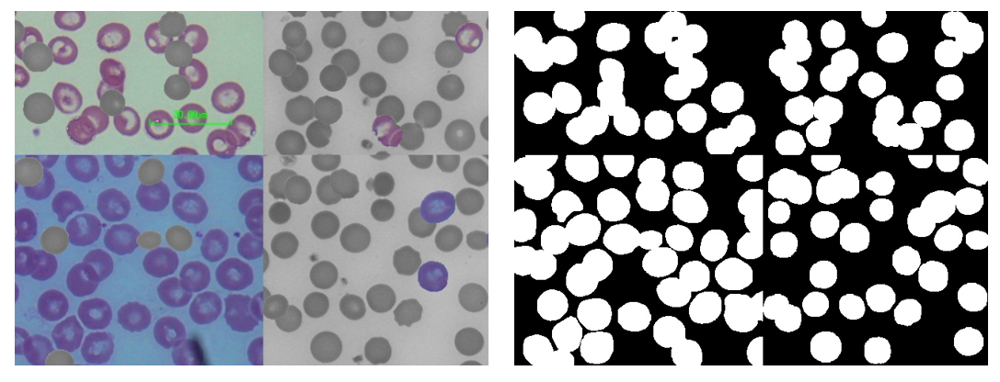
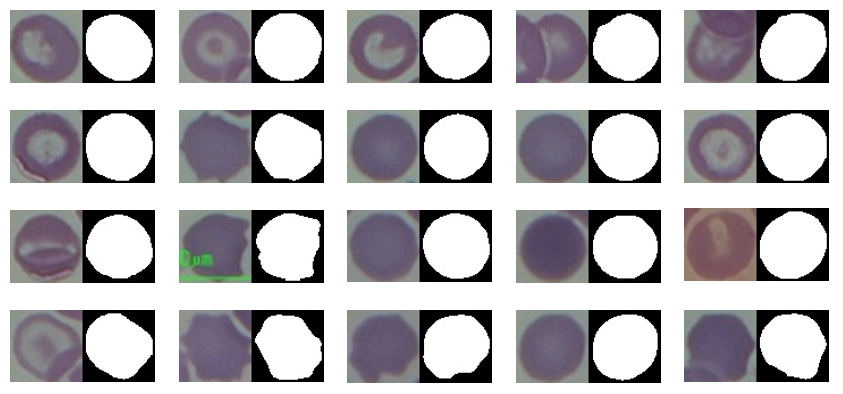

# U-Lite

一个多月前在微信公众号刷到一篇医学图像分割的文章介绍，作者实现了一种轻量级的U-Net模型，而且可以实现几乎相当甚至更好的性能，也就是U-Lite。我满心期待着作者早日开源代码出来，可是过了这一个多月，还是毫无进展。无奈，只能花几天自己动手写下代码，并标了几张数据试验了一下。结果还行，模型也很小，确实值得一用。这里主要介绍下我的代码的使用方式，以及试验的结果，关于文章的详细介绍可以看参考部分的公众号文章。

## 数据

- 准备数据

按照如下格式准备数据：

```shell
- data directory
	- images directory
		- 1.png
		- 2.jpg
		...
	- labels directory
		- 1.txt	(class x1 y1 x2 y2 ... xn yn)
		- 2.txt
		...
	- classes.txt
	- train.txt
	- valid.txt
	- test.txt
	- param.yaml（也可不放在这里）
```

每张图像的label文件是yolo式的txt文件，每行表示一个目标，第一个数字表示目标的类别，后面的数字表示目标的轮廓坐标。classes.txt里面是目标的类别，train.txt、valid.txt、test.txt里面是不带后缀的图像文件名，param.yaml是所想要使用的模型结构、数据增强和优化器参数。

- 数据增强

说实话，以往的医学图像分割在数据处理上，似乎比较谨慎。我觉得有时也可以用一下，就把yolo系列的数据增强拿来用了一下，当然，如果想关闭，可以在param.yaml中对相关参数进行修改。下面是一个数据增强后的图像示例：



## 训练

这套代码可以训练单个目标的小图像，也可以训练含多个目标的大图像，只需在param.yaml中对相关参数进行调整即可。

- 训练单个目标图像的命令示例：

``` shell
$ cd U-Lite
$ python train.py --data data/crop_chula --img-size 64 64 --cfg data/crop_chula/param.yaml --workers 4 --epochs 300 --batch-size 16 --gpu 0 --amp --cache --save-dir runs/crop_chula
```

- 训练含多个目标的图像的命令示例：

``` Shell
$ cd U-Lite
$ python train.py --data data/chula --img-size 512 640 --cfg data/chula/param.yaml --workers 4 --epochs 300 --batch-size 4 --gpu 0 --amp --cache --save-dir runs/chula
```

## 推理

**infer_demo.py -- inferDemo** 函数是一个推理示例，你可以修改参数以推理自己的数据集。

## 效果

单个目标分割效果：



多个目标分割效果：


## 源码

所有源码和测试数据放在了Github里面，需者自提：

https://github.com/Accustomer/U-Lite.git

## 参考

[UNet家族迎来最小模型U-Lite | 800K参数实现性能极限超车 (qq.com)](https://mp.weixin.qq.com/s/tzITXfpMpgQaUEQNvQKzdQ)

[GitHub - duong-db/U-Lite: A lightweight CNN-based model for medical image segmentation.](https://github.com/duong-db/U-Lite)