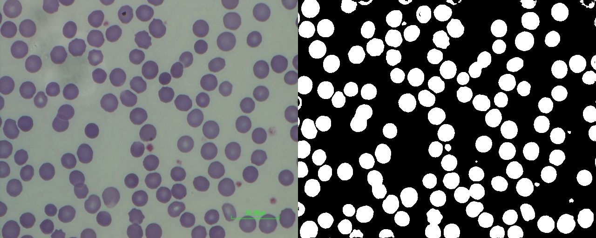

# U-Lite
Unofficial Pytorch-Implementation of "1M parameters are enough? A lightweight CNN-Based model for medical image segmentation". 
## Train
Use following commands to train yourself dataset.

### Single object

``` Shell
$ cd ULite
$ python train.py --data data/crop_chula --img-size 64 64 --cfg data/crop_chula/param.yaml --workers 4 --epochs 300 --batch-size 16 --gpu 0 --amp --cache --save-dir runs/crop_chula
```
### Multiple objects
``` Shell
$ cd ULite
$ python train.py --data data/chula --img-size 512 640 --cfg data/chula/param.yaml --workers 4 --epochs 300 --batch-size 4 --gpu 0 --amp --cache --save-dir runs/chula
```

## Inference

Change some parameters in **infer_demo.py -- inferDemo** to inference yourself dataset.

### Single object example


### Multiple objects example



See more details in https://zhuanlan.zhihu.com/p/630885217

